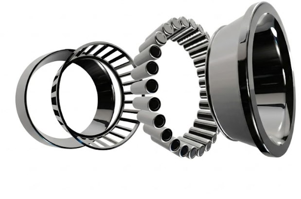

# 3D Photorealistic Rotating Bearing

A high-performance 3D visualization of a stainless steel bearing.

## 🚀 From Image to 3D with Gemini
This project is a demonstration of **AI-driven procedural modeling**. It was developed entirely by starting with a static reference image and using **Gemini** to generate the complex Three.js geometry, PBR materials, and physical-time-based rotation engine.

### Reference vs Model
| Original Image | 3D Rendered Demo |
| :---: | :---: |
|  |  |

## Features
- **Auto-Rotation**: Smooth horizontal rotation using a physical-time-based engine.
- **Photorealistic Materials**: Physical-based rendering (PBR) for polished and brushed stainless steel.
- **Cinematic Lighting**: ACES Filmic Tone Mapping and environment mapping (RoomEnvironment).
- **Accurate Geometry**: Procedural generation of outer rings, rollers, and cage structures.
- **Interactive Controls**: Orbital movement, zoom, and rotation.

## Technologies Used
- HTML5 / CSS3
- JavaScript (ES6 Modules)
- [Three.js](https://threejs.org/)
- OrbitControls & PMREM (Environment Mapping)

## How to Run
Simply open `index.html` in a modern web browser that supports ES modules.

---
*Created with the help of Gemini.*
